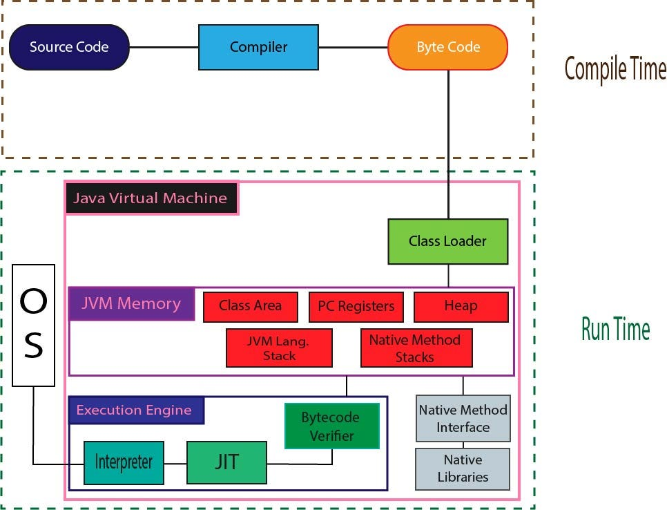

# First Java Program | Hello World Example

## Software Requirements

In this section, we will learn how to write a simple program in Java. We can write a simple "Hello Java" program easily after installing the JDK.

### Requirement for Java Hello World Example

For executing any Java program, the following software or application must be properly installed:

1. Install the JDK if you don't have it installed already. You can download the JDK and install it.
2. Set the path of the `jdk/bin` directory. [Click here](http://www.javatpoint.com/how-to-set-path-in-java) for instructions on how to set the path.
3. Create the Java program.
4. Compile and run the Java program.

### Creating Hello World Example

Let's create the "Hello Java" program:

```java
class Simple {  
    public static void main(String args[]) {  
        System.out.println("Hello Java");  
    }  
}  
```

Save the above code in a file named `Simple.java`.

To compile:
```
javac Simple.java
```

To execute:
```
java Simple
```

Output:
```
Hello Java
```

**Compilation Flow:**

When we compile a Java program using the `javac` tool, the Java compiler converts the source code into byte code.

### Parameters used in First Java Program

Let's understand the meaning of the following terms:

- `class`: keyword used to declare a class in Java.
- `public`: access modifier that represents visibility. It means it is visible to all.
- `static`: keyword. If we declare any method as static, it is known as the static method. The core advantage of the static method is that there is no need to create an object to invoke the static method. The `main()` method is executed by the JVM, so it doesn't require creating an object to invoke the `main()` method. So, it saves memory.
- `void`: return type of the method. It means it doesn't return any value.
- `main`: represents the starting point of the program.
- `String[] args` or `String args[]`: used for command-line arguments.

`System.out.println()` is used to print a statement. Here, `System` is a class, `out` is an object of the `PrintStream` class, `println()` is a method of the `PrintStream` class.

## java compilation process diagram
